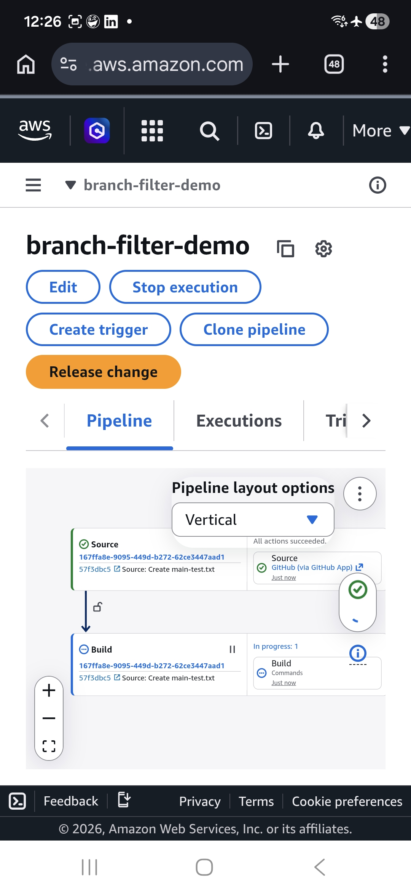

# AWS CodePipeline Branch Filter

## DevOps Hands-on Project

This project demonstrates how to configure AWS CodePipeline to trigger CI/CD workflows only for a specific Git branch.

Key DevOps concepts demonstrated:

- Git branching strategy
- CI/CD pipeline trigger control
- GitHub integration with AWS CodePipeline
- Automated build pipeline

---

## Project goal

Demonstrate how AWS CodePipeline can be configured to trigger only for a specific Git branch.

This repository is used to test branch filtering in the Source stage of AWS CodePipeline.

---

## Architecture

Developer → GitHub → AWS CodePipeline → Build

The pipeline is configured to trigger only when commits are pushed to the `main` branch.

---

## Scenario tested

Push to `dev` branch

Result:

Pipeline does NOT start

This simulates development changes that should not trigger the production pipeline.

---

Push to `main` branch

Result:

Pipeline starts automatically

This represents production-ready code being merged to the main branch.

---

## Technologies used

- AWS CodePipeline
- AWS CodeBuild
- GitHub repository
- GitHub App connection
- Branch filtering in Source stage

---

## Repository structure

main branch → production pipeline trigger

dev branch → development changes

Typical workflow:

feature branch  
↓  
pull request  
↓  
merge to dev  
↓  
testing  
↓  
merge to main  
↓  
CodePipeline triggers build

---

## DevOps concept demonstrated

Branch filtering allows CI/CD pipelines to run only for specific branches.

This helps:

- avoid unnecessary pipeline executions
- protect production environments
- separate development and production workflows

Typical real-world setup:

feature branches  
↓  
pull request  
↓  
merge to main  
↓  
pipeline triggers build and deployment

---

## Example pipeline flow

Developer  
↓  
Push code  
↓  
GitHub repository  
↓  
AWS CodePipeline  
↓  
Build stage (CodeBuild)

---

## Author

Hands-on DevOps practice project demonstrating:

- AWS CodePipeline
- GitHub integration
- CI/CD pipeline triggers
- Branch filtering configuration
